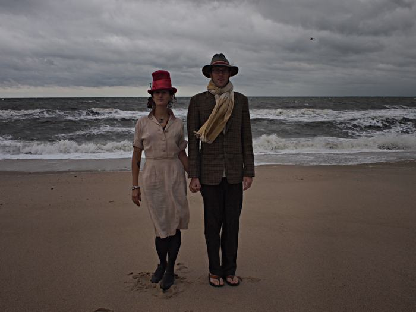

  
Nomads turned homesteaders.  We wandered Mexico, the Himalayas and the American west for six years together before settling down in Truth or Consequences New Mexico.  How we choose this gem of a town is another story all together, for now let's just say its a perfect fit for us.

While living in the Himalayas of northern India we were exposed to the living art of weaving and textiles for the first time.  Every house has a loom once you get up into the hills.  The shepards wear shawls and coats woven by their wives and mothers and they walk around spinning the wool of their sheep on a drop spindle.  It seemed that around every corner we were encountering someone working on textiles.

It was when we bought our first shawls that the bug really stuck.  After that we were on a mission to learn all we could about textiles, hand looms and hand spinning.  India, as it was, is the perfect classroom for a textile fledgling.

After a few years our time in India came to a close and we found ourselves back in the States.  Not knowing where to live we built a teardrop camper and bought a loom and lived the nomad life up and down the rockies, practicing the art of the hand loom.  As we became weary of life on the road we found ourselves inexplicably drawn to Truth or Consequences New Mexico where we now live spending our time weaving, gardening, home repairing and painting.

Weaving has the power to change people and society for the better as demonstrated by the pivotal role weaving played in Gandhi's campaign for freedom.  Our efforts are to bring weaving knowledge to as many people as possible - be it just talking to them in our shop, teaching them, or doing demonstrations and art projects.  The ancient rythym of weaving is recognized inside as soon as you look at a loom, and this is what makes it so special.  We just hope to share this spark of the old dance with the modern world.
